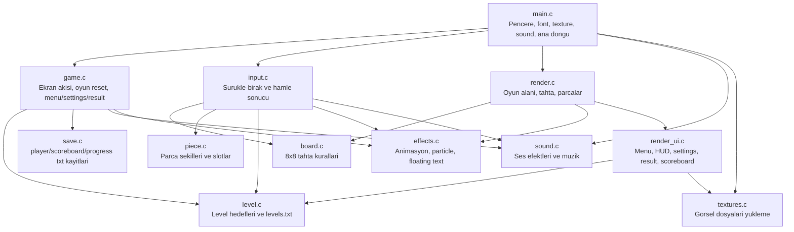
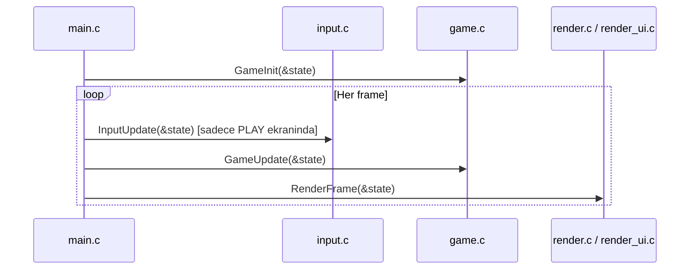
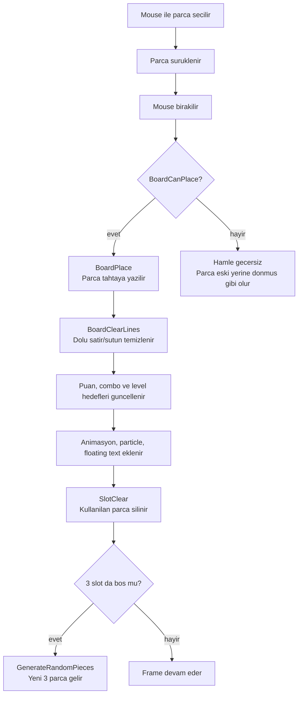
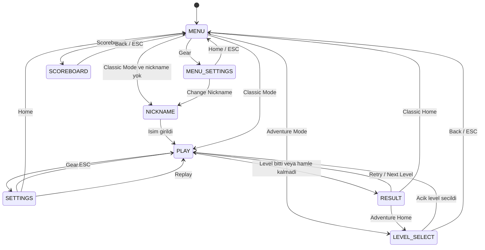
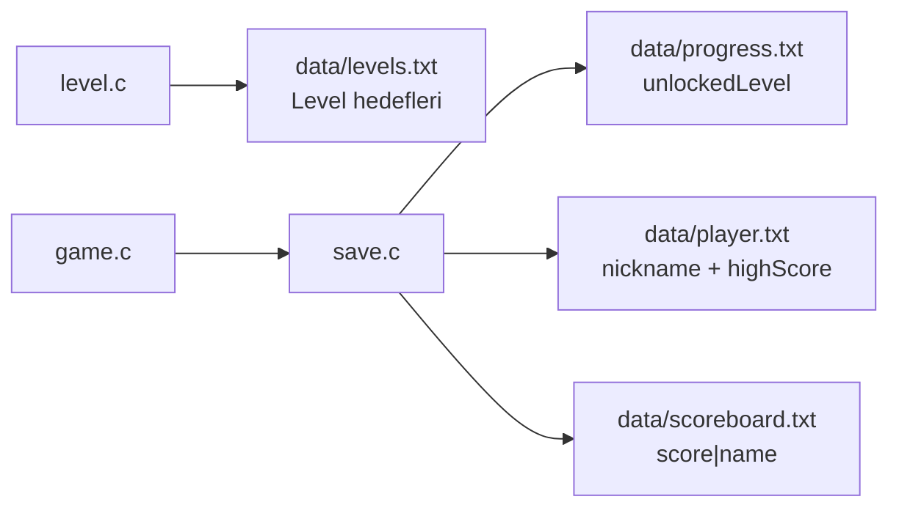

# Codebase Guide

Bu dokuman, projeyi ilk kez acan birinin "nereden baslamaliyim?" sorusuna cevap vermek icin hazirlandi. Amac her fonksiyonu anlatmak degil; oyunun buyuk resmini, ana akislari ve dosyalarin sorumluluklarini gostermek.

## 1. Buyuk Resim

Oyun raylib'in klasik oyun dongusuyle calisir: once pencere ve kaynaklar hazirlanir, sonra her frame'de input, update ve render adimlari calisir.



## 2. Ana Oyun Dongusu

`main.c` cok kucuk tutulur. Asil fikir sudur: oyun durumunu guncelle, sonra ekrana ciz.



Okurken once su sirayi takip etmek iyi olur:

1. `src/main.c`: Program nerede basliyor?
2. `include/game.h`: `GameState` icinde hangi bilgiler tutuluyor?
3. `src/game.c`: Hangi ekrandayiz, butona basilinca nereye gidiyoruz?
4. `src/input.c`: Bir parca tahtaya birakilinca ne oluyor?
5. `src/board.c` ve `src/piece.c`: Tahta ve parca kurallari nasil calisiyor?

## 3. Hamle Akisi

Oyuncu bir parcayi surukleyip tahtaya biraktiginda birden fazla sistem devreye girer. Bu akis oyunun cekirdegidir.



Bu akisin ana dosyasi `src/input.c` dosyasidir. Tahta kurallari `src/board.c`, parca uretimi `src/piece.c`, gorsel geri bildirimler `src/effects.c` icindedir.

## 4. Ekran Akisi

Oyunda birden fazla ekran var ama hepsi tek enum ile takip edilir: `Screen currentScreen`.



Bu akisin ana dosyasi `src/game.c` dosyasidir. Cizim kismi `src/render_ui.c` icindedir.

## 5. Veri Dosyalari

Oyun icindeki duzenlenebilir ve kaydedilebilir bilgiler `data/` klasorunde tutulur. Bu klasor `.gitignore` icindedir.



En onemli iki dosya:

- `data/levels.txt`: Hocalar level hedeflerini buradan degistirebilir.
- `data/progress.txt`: Oyuncunun en son hangi level'a kadar actigini tutar.

`progress.txt` ornegi:

```text
unlockedLevel=8
```

Bu, 1-7 arasi level'lar gecildi ve 8. level acik demektir.

## 6. Dosya Sorumluluklari

| Dosya | Ne is yapar? | Ne zaman okunur? |
|---|---|---|
| `main.c` | Programi baslatir, ana donguyu calistirir | Ilk okunacak dosya |
| `game.c` | Ekran gecisleri, oyun reset, sonuc ve settings mantigi | "Oyun hangi ekranda?" sorusu icin |
| `input.c` | Parca surukle-birak ve hamle sonucu | "Hamle nasil isleniyor?" sorusu icin |
| `board.c` | Tahtaya parca sigar mi, satir/sutun temizlenir mi? | Oyun kurallari icin |
| `piece.c` | Parca sekilleri, renkleri ve slotlar | Parcalar nasil uretiliyor? |
| `level.c` | Level hedefleri ve hedef kontrolu | Macera modu icin |
| `save.c` | Metin kayit dosyalari | Kayitlar nerede? |
| `render.c` | Oyun tahtasi ve parcalari cizer | PLAY ekraninin cizimi icin |
| `render_ui.c` | Menu, ayarlar, scoreboard, result cizer | UI ekranlari icin |
| `effects.c` | Animasyon, particle, floating text | Gorsel susler icin |
| `sound.c` | Ses ve muzik | Ses davranisi icin |
| `textures.c` | Image dosyalarini yukler | Asset yukleme icin |

## 7. Sunumda Anlatma Sirasi

Arkadaslara veya hocaya anlatirken su 5 dakikalik rota ise yarar:

1. `main.c`: "Raylib penceresi aciliyor, sonra her frame update + render calisiyor."
2. `GameState`: "Oyundaki tum anlik bilgiler burada."
3. `input.c`: "Oyuncu parcayi birakinca tahta kontrol ediliyor."
4. `board.c`: "Satir/sutun doluysa temizleniyor."
5. `save.c` ve `data/levels.txt`: "Level ve kullanici verileri metin dosyalarindan geliyor."

Bu rota once ana fikri verir, sonra detaylara inmeyi kolaylastirir.
